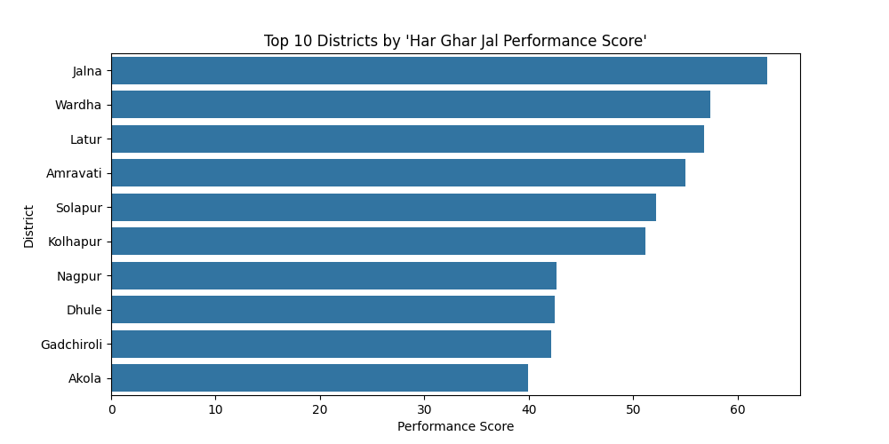
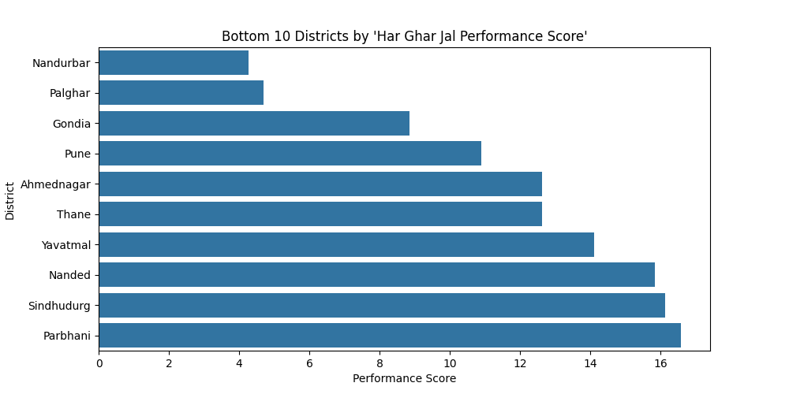
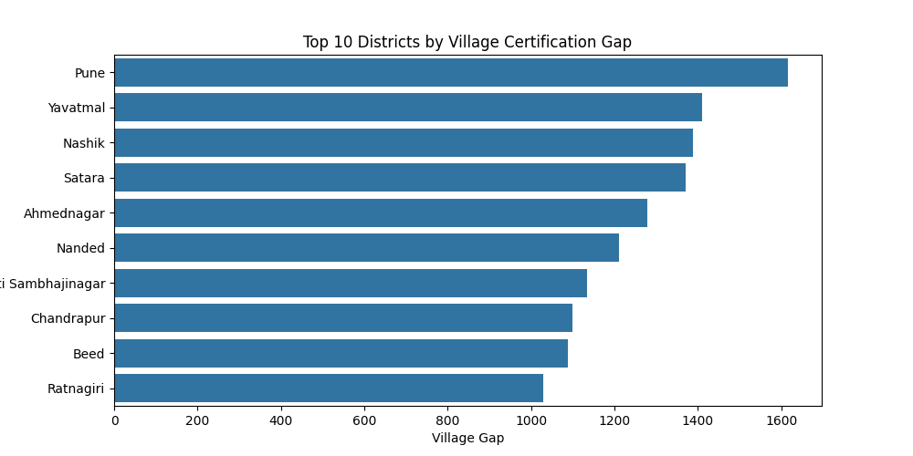
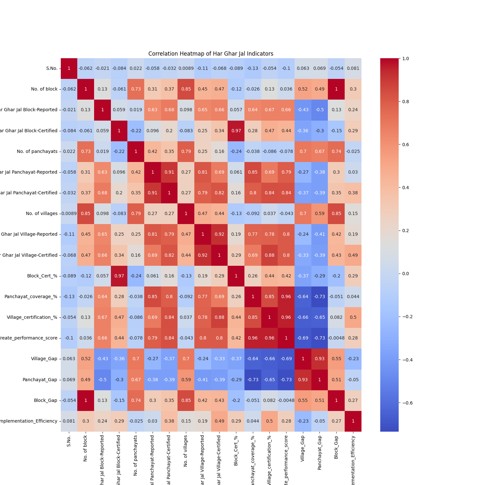

# Har Ghar Jal Scheme – District Level Data Analysis

## Project Overview

This project analyzes the district-level progress of the **Har Ghar Jal Scheme**, a Government of India initiative aimed at providing safe drinking water to rural households.

The objective of this project is to evaluate implementation progress across districts, identify performance differences, and highlight areas where certification or coverage gaps still exist.

The analysis is performed using Python for data processing, feature engineering, and data visualization.

---

# Dataset

Source: Government Open Data Portal

Dataset used in this project:

`Details_of_Har_Ghar_Jal.csv`

The dataset contains district-level indicators including:

* Number of Panchayats
* Number of Villages
* Number of Blocks
* Har Ghar Jal Panchayats Reported
* Har Ghar Jal Villages Certified
* Har Ghar Jal Blocks Certified

---

# Tools & Technologies

The project was implemented using the following tools and libraries:

* Python
* Pandas
* NumPy
* Matplotlib
* Seaborn

---

# Data Processing

Several analytical indicators were created from the original dataset to better evaluate district performance.

Derived indicators include:

* **Block Certification Rate (%)**
* **Panchayat Coverage Rate (%)**
* **Village Certification Rate (%)**
* **District Performance Score**
* **Village Gap**
* **Panchayat Gap**
* **Block Gap**
* **Implementation Efficiency**

These metrics allow comparison of how effectively different districts are implementing the Har Ghar Jal scheme.

---

# Key Analysis Performed

## District Performance Ranking

Districts are ranked based on a **Performance Score**, calculated as the average of:

* Block Certification Rate
* Panchayat Coverage Rate
* Village Certification Rate

This ranking highlights both high-performing and low-performing districts.

---

## Gap Analysis

Gap analysis was conducted to identify districts where implementation is incomplete.

The following gaps were calculated:

* Village Gap
* Panchayat Gap
* Block Gap

A larger gap indicates that more work is required to achieve full certification.

---

## Implementation Efficiency

Implementation efficiency evaluates how effectively reported villages are converted into certified villages.

Formula used:

Certified Villages / Reported Villages

Higher efficiency indicates stronger implementation performance.

---

## Correlation Analysis

A **correlation heatmap** was generated to examine relationships between indicators such as:

* Number of villages
* Panchayat coverage
* Block certification
* Village certification

This analysis helps identify how different variables influence overall performance.

---

## Distribution Analysis

The distribution of **Village Certification Percentage** across districts was analyzed using a histogram to understand variations in certification performance.

---

# Visualizations

## 📊 Visualizations

### Top Performing Districts

### Bottom Performing Districts

### Village Gap Analysis

### Correlation Heatmap

---

# Output Files

The project generates:

* Processed dataset
  `har_ghar_jal_processed_data.csv`

* Visualization charts saved as PNG files.

---

# Conclusion

This analysis provides insights into the progress of the Har Ghar Jal scheme across districts. By examining certification rates, implementation gaps, and efficiency levels, the project highlights districts performing well and those that may require additional administrative focus.

---

# Author

**OM RAMESH KALE**
Python | Data Analysis
